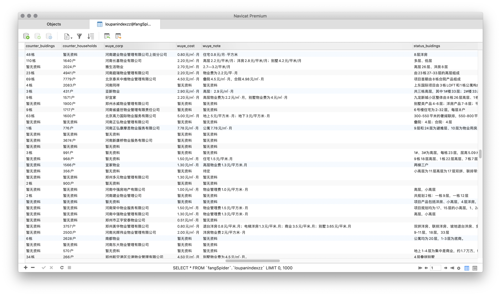
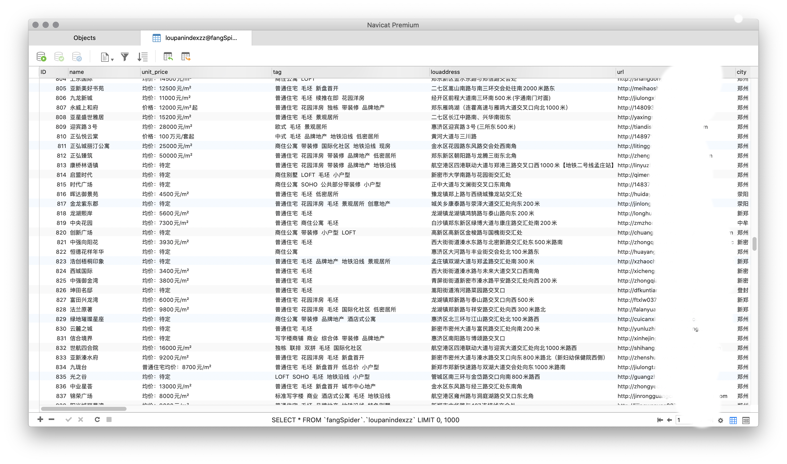
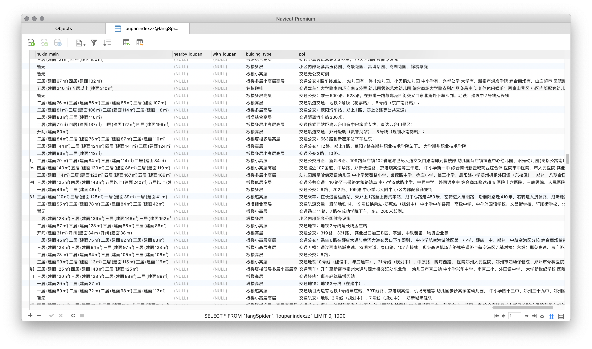
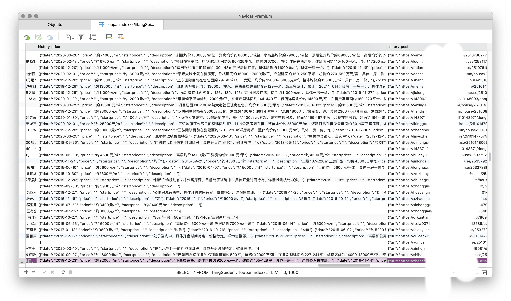
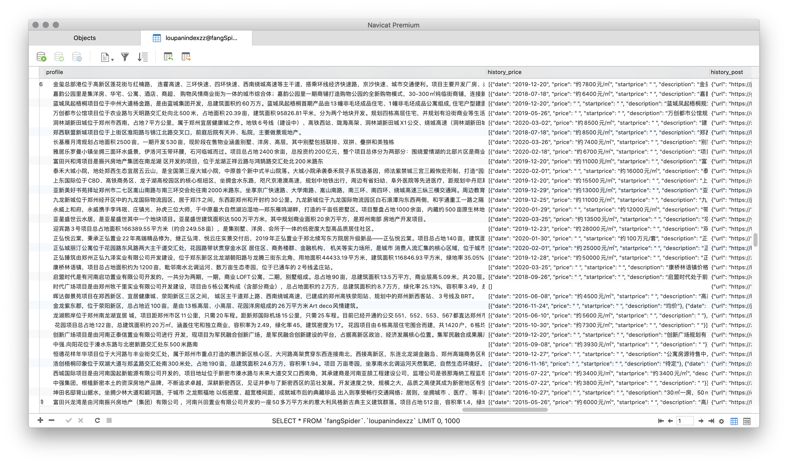
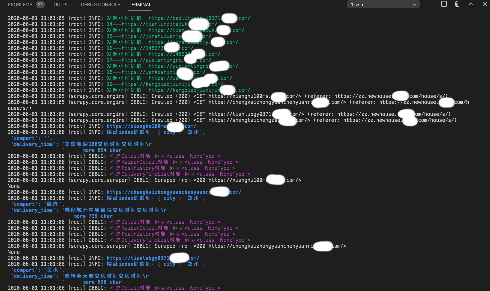

<p align="center">


</p>

## Todo
* ✅ 新房数据抓取
* ☑️ 二手房房源抓取
* ☑️ 租房房源抓取 
* ☑️ 添加 scrapy-redis  以支持分布式
* ☑️ 优化数据库使匹配高并发，批量执行语句或在中间增加一层cache

## Requirement
Python3.5+ and Scrapy2.0, Mysql 6.0+, requirements.txt extension installed.


## Quick Start
Note：This is requires python3, scrapy, requirements.txt extension in order to work. 

```bash
git clone https://github.com/veveup/fangSpider.git
cd fangSpider

pip -r install requirements.txt

mysql -u root -p
//connection to mysql, create DATABASE and create TABEL

CREATE DATABASE IF NOT EXISTS `fangSpider` /*!40100 DEFAULT CHARACTER SET utf8mb4 COLLATE utf8mb4_general_ci */ /*!80016 DEFAULT ENCRYPTION='N' */

use fangSpider;

source ./sql/loupanindex.sql;
// 使用 ./sql/loupanindex.sql 文件创建 TABEL 
// 退出 mysql 交互页面


scrapy crawl fangIndex
//默认爬取郑州城市在售小区 楼盘信息 
```
## Demo


[comment]: <>


[//]:<>




## More usage

+ ### **修改 TABEL 名字，将不同城市的数据放入不同的表内**
```sql

# 1、修改 ./sql/loupanindex.sql 文件中 loupanindex 表名 然后重新执行 sql 文件
CREATE TABLE `loupanindex` (

# 2、修改 ./mysqlcfg.py 内关于数据库表名的定义
TABLENAME = 'loupanindex'
```
+ ### **爬取所有城市数据**
```python
./fangSpider/spiders/fangIndex.py

#是否只抓取一个城市 开关设为False
isSoloCityOnly = False
# 从相应网站获得 城市的代码 比如郑州是 zz 仅在isSoloCityOnly 为 True 时有效
citycode = 'zz'
```
>**Note:** 全部城市小区大概有55000+个 单机抓取会需要很长时间 在测试中 1000 个小区大概需要 二十分钟，并且一直访问网站有可能会出现验证码 甚至被封ip 如果必要可以了解一下如何使用 Proxy 和 Redis 分布爬取

+ ### **配置 mysql 数据库连接信息**
```python
./fangSpider/mysqlcfg.py
host = '127.0.0.1'
user = 'root'
passwd = '12345678'
database ='fangSpider'
TABLENAME = 'loupanindex'
```

+ ### **运行中终端行没有 log细节 输出，但是本地生成的logScrapy.log 文件有内容**
```python
./fangSpider/mylogger.py

# windows 或无法输出log的情况下打开下面这行代码  Mac下打开会重复输出 Log 还没找到原因
#self.logger.addHandler(ch)
self.logger.propagate = False

# 为了能同时输出到终端以及保存到log文件 添加了 logging ，但在linux系统下会和scrapy的logging出现重复输出的情况 所以关闭了 mylogger 的终端输出能力 使用系统默认的输出 
```

